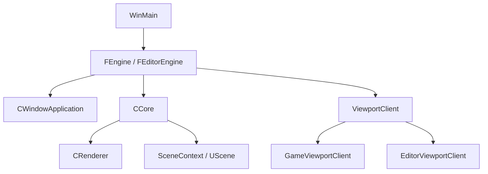
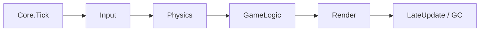

# Jungle Engine

`Jungle Engine`는 `C++20 + DirectX 11 + Win32 + ImGui` 기반으로 만든 3D 엔진/에디터 프로젝트입니다.  
이 문서는 프로젝트 중간에 합류한 사람도 **코드 구조, 설계 의도, 실행 흐름, 데이터 포맷, 확장 포인트**까지 빠르게 이해할 수 있도록 작성한 온보딩용 README입니다.

---

## 1. 이 프로젝트를 한 문장으로 설명하면

`렌더러`, `오브젝트 시스템`, `씬 저장/로드`, `에디터 UI`, `Picking/Gizmo`까지 직접 구현한 **작은 게임 엔진 프로토타입**입니다.

즉, 단순한 그래픽스 데모가 아니라 다음 요소들이 연결된 프로젝트입니다.

- 런타임 구조
- DirectX 11 렌더링 백엔드
- `UObject - Actor - Component` 계층
- JSON 기반 Scene/Material 데이터
- ImGui 기반 Editor
- 오브젝트 선택(Picking)과 변형(Gizmo)

---

## 2. 이 README의 목표

이 문서는 아래 질문에 답하도록 구성되어 있습니다.

- 이 프로젝트는 어떤 문제를 해결하려고 했는가?
- 소스 트리는 어떻게 나뉘어 있는가?
- 프로그램은 어디서 시작해서 어디로 흐르는가?
- 씬, 오브젝트, 렌더링, 에디터는 어떻게 연결되는가?
- 처음 코드를 읽을 때 어떤 파일부터 봐야 하는가?
- 기능을 추가하려면 어느 지점부터 건드리면 되는가?

---

## 3. 빠른 요약

### 핵심 기술

- Language: `C++20`
- Graphics API: `DirectX 11`
- Platform: `Windows x64`
- UI: `ImGui`
- Data: `JSON`
- Build Tool: `msbuild`, `Visual Studio 2022`

### 실행 대상

- `Engine`
  - 공용 런타임/렌더링 코드
- `Editor`
  - 편집 도구 실행 파일
- `Client`
  - 게임 실행 파일

### 핵심 설계 포인트

- `CRenderer`는 공용 GPU 백엔드로 유지
- 게임과 에디터의 차이는 `ViewportClient` 정책 객체로 분리
- 씬은 `Game`, `Editor`, `Preview` 컨텍스트로 분리
- 씬/머티리얼은 JSON으로 저장 및 로드
- 에디터는 오프스크린 렌더 타깃을 ImGui 뷰포트에 표시

---

## 4. 저장소 구조

```text
KraftonJungleEngine.sln
├─ Engine/
│  ├─ Source/
│  │  ├─ Core/         # 엔진 부트스트랩, 메인 루프, 경로, 타이머, ViewportClient
│  │  ├─ Scene/        # Scene, SceneContext, SceneType
│  │  ├─ Object/       # UObject, UClass, ObjectFactory, ObjectManager
│  │  ├─ Actor/        # AActor, CubeActor, SphereActor, AttachTestActor
│  │  ├─ Component/    # SceneComponent, PrimitiveComponent, CameraComponent
│  │  ├─ Renderer/     # DirectX 11 렌더러, Material, Shader, RenderCommand
│  │  ├─ Primitive/    # Cube/Plane/Sphere/Gizmo 메시 생성
│  │  ├─ Math/         # Vector, Matrix, Quat, Transform, Frustum
│  │  ├─ Input/        # InputManager, EnhancedInputManager
│  │  ├─ Camera/       # 카메라 이동/회전
│  │  ├─ Platform/     # Win32 창/앱 래퍼
│  │  ├─ Debug/        # 엔진 로그
│  │  └─ Types/        # TArray, TMap, TSet, FString 등
│  └─ Shaders/         # HLSL 셰이더
├─ Editor/
│  ├─ Source/
│  │  ├─ UI/           # EditorUI, Viewport, ControlPanel, Property, Console, Stat
│  │  ├─ Gizmo/        # Transform Gizmo 로직
│  │  ├─ Picking/      # Ray Casting 기반 오브젝트 선택
│  │  ├─ Controller/   # 에디터 카메라 입력 제어
│  │  ├─ Pawn/         # EditorCameraPawn
│  │  └─ Axis/         # 축 렌더링 유틸리티
│  └─ ThirdParty/
│     └─ imgui/
├─ Client/
│  └─ Source/          # 게임 실행 진입점
├─ Assets/
│  ├─ Scenes/          # Scene JSON
│  └─ Materials/       # Material JSON
├─ docs/               # Doxygen 결과 및 문서 초안
└─ Scripts/            # 프로젝트 파일 생성/보조 스크립트
```

### 초심자를 위한 해석

- `Engine`는 공용 엔진 코드입니다.
- `Editor`는 엔진 위에 편집 도구를 얹은 프로젝트입니다.
- `Client`는 엔진을 게임처럼 실행하는 가장 얇은 진입점입니다.
- `Assets`는 런타임 데이터입니다.

---

## 5. 처음 읽는 사람을 위한 추천 독서 순서

프로젝트를 이해할 때는 아래 순서로 보면 가장 빠릅니다.

### 1단계: 프로그램이 어디서 시작하는지 보기

- `Client/Source/main.cpp`
- `Editor/Source/main.cpp`
- `Engine/Source/Core/FEngine.h`
- `Engine/Source/Core/FEngine.cpp`
- `Editor/Source/FEditorEngine.h`
- `Editor/Source/FEditorEngine.cpp`

### 2단계: 메인 루프와 씬/렌더링 연결 보기

- `Engine/Source/Core/Core.h`
- `Engine/Source/Core/Core.cpp`
- `Engine/Source/Core/ViewportClient.h`
- `Engine/Source/Core/ViewportClient.cpp`
- `Engine/Source/Scene/SceneContext.h`
- `Engine/Source/Scene/Scene.h`
- `Engine/Source/Scene/Scene.cpp`

### 3단계: 오브젝트와 컴포넌트 구조 보기

- `Engine/Source/Object/Object.h`
- `Engine/Source/Object/Class.h`
- `Engine/Source/Object/ObjectFactory.h`
- `Engine/Source/Object/ObjectManager.h`
- `Engine/Source/Actor/Actor.h`
- `Engine/Source/Component/SceneComponent.h`
- `Engine/Source/Component/PrimitiveComponent.h`

### 4단계: 렌더링 경로 보기

- `Engine/Source/Renderer/RenderCommand.h`
- `Engine/Source/Renderer/Renderer.h`
- `Engine/Source/Renderer/Renderer.cpp`
- `Engine/Source/Renderer/Material.h`
- `Engine/Source/Renderer/MaterialManager.h`

### 5단계: 에디터 구조 보기

- `Editor/Source/UI/EditorUI.h`
- `Editor/Source/UI/EditorUI.cpp`
- `Editor/Source/UI/Viewport.h`
- `Editor/Source/UI/Viewport.cpp`
- `Editor/Source/UI/EditorViewportClient.h`
- `Editor/Source/UI/EditorViewportClient.cpp`
- `Editor/Source/Picking/Picker.cpp`
- `Editor/Source/Gizmo/Gizmo.h`

---

## 6. 프로그램은 어떻게 시작되는가

## 6.1 Client 실행 흐름

`Client`는 가장 단순합니다.

1. `Client/Source/main.cpp`에서 `FEngine` 생성
2. `FEngine::Initialize()` 호출
3. Win32 앱/메인 윈도우 생성
4. `CCore` 생성 및 초기화
5. 기본 `CGameViewportClient` 생성
6. 메인 루프 실행

## 6.2 Editor 실행 흐름

`Editor`는 `FEditorEngine`이 `FEngine`을 확장합니다.

1. `Editor/Source/main.cpp`에서 `FEditorEngine` 생성
2. `FEditorEngine::Initialize()` 호출
3. 내부적으로 `FEngine::Initialize()` 수행
4. Startup Scene Type을 `Editor`로 설정
5. `CEditorViewportClient` 생성
6. `EditorUI`, `EditorViewportController`, `EditorCameraPawn` 초기화
7. Preview Scene도 별도로 생성

아래 다이어그램으로 보면 더 쉽습니다.



---

## 7. 핵심 런타임 구조

## 7.1 `FEngine`

`FEngine`은 엔진의 가장 바깥쪽 부트스트랩입니다.

역할:

- Win32 앱 생성
- 메인 윈도우 생성
- `CCore` 생성 및 초기화
- `ViewportClient` 연결
- 메시지 펌프와 메인 루프 실행

한 줄 요약:

> `FEngine`은 "앱을 띄우고 Core를 돌리는 상위 실행기"입니다.

## 7.2 `CCore`

`CCore`는 실제 프레임 루프의 중심입니다.

역할:

- `Renderer` 소유
- `SceneContext` 소유
- `InputManager`, `EnhancedInputManager` 소유
- 매 프레임 `Input -> Physics -> GameLogic -> Render -> LateUpdate`
- 현재 활성 `ViewportClient`에 따라 렌더링 정책 위임

한 줄 요약:

> `CCore`는 "이번 프레임에 무엇을 할지 결정하는 실행 관리자"입니다.

## 7.3 `SceneContext`

씬을 하나만 두지 않고 `SceneContext`로 나눕니다.

현재 구분:

- `Game`
- `Editor`
- `PIE`
- `Preview`
- `Inactive`

설계 의도:

- 에디터가 게임 씬과 별도 씬을 다룰 수 있게 하기 위함
- Preview 전용 씬을 추가할 수 있게 하기 위함

## 7.4 `ViewportClient`

이 프로젝트에서 가장 중요한 설계 중 하나입니다.

핵심 아이디어:

- `CRenderer`는 공용 렌더링 백엔드로 유지
- 게임과 에디터의 차이는 `IViewportClient`가 결정

구현 클래스:

- `CGameViewportClient`
  - 게임 실행 정책
  - ImGui/Outline/Axis 없음
- `CEditorViewportClient`
  - 에디터 실행 정책
  - EditorUI, Gizmo, Picking, Outline, Axis 사용
- `CPreviewViewportClient`
  - Preview Scene 전용 정책

한 줄 요약:

> `Renderer`는 그리는 기계이고, `ViewportClient`는 "이번 창을 어떤 규칙으로 그릴지" 정하는 정책 객체입니다.

---

## 8. 프레임 루프

`CCore::Tick()`은 대략 다음 순서로 진행됩니다.



### 실제 렌더 단계 내부

1. `ViewportClient->ResolveScene()` 호출
2. 이번 프레임에 렌더할 Scene 결정
3. `Renderer->BeginFrame()`
4. 활성 카메라의 View / Projection 계산
5. Frustum 추출
6. `ViewportClient->BuildRenderCommands()` 호출
7. `Renderer->SubmitCommands()`
8. `Renderer->ExecuteCommands()`
9. `Renderer->EndFrame()`

### 왜 이렇게 나눴는가

- 씬은 "무엇을 그릴지"만 알고
- 렌더러는 "어떻게 GPU에 제출할지"만 알고
- 에디터/게임 차이는 ViewportClient에서 처리하게 하기 위해서입니다.

---

## 9. 오브젝트 시스템

## 9.1 `UObject`

모든 런타임 객체의 공통 기반입니다.

제공하는 것:

- 이름
- Outer
- `UClass*`
- UUID
- InternalIndex
- ObjectSize
- Flags (`PendingKill` 등)

특징:

- 전역 배열 `GUObjectArray`에 등록
- `operator new/delete`를 오버로드해서 메모리 통계 추적

왜 필요한가:

- 엔진 내부 객체를 한 곳에서 추적하기 위해
- 타입 검사와 오브젝트 생명주기 관리를 단순화하기 위해

## 9.2 `UClass`

런타임 타입 정보입니다.

제공하는 것:

- 클래스 이름
- 부모 클래스
- 팩토리 함수
- `IsChildOf()`
- `CreateInstance()`

즉, C++ RTTI를 완전히 대체하는 것은 아니지만 엔진 내부에서 사용할 수 있는 가벼운 리플렉션 계층입니다.

## 9.3 `FObjectFactory`

엔진 객체 생성의 진입점입니다.

역할:

- `UClass`를 통해 실제 객체 생성
- UUID 발급
- `GUObjectArray` 등록

실제 사용 예:

- `ConstructObject<T>()`
- `Scene->SpawnActor<T>()`

## 9.4 `ObjectManager`

직접적인 GC는 아니지만, `PendingKill` 오브젝트를 정리하는 관리자입니다.

역할:

- 죽은 오브젝트 플러시
- 전역 배열의 null 정리

현재 `CCore::LateUpdate()`에서 일정 주기마다 GC 비슷한 정리가 수행됩니다.

---

## 10. Actor / Component 구조

## 10.1 `AActor`

씬에 존재하는 개체입니다.

담당:

- 루트 컴포넌트 보유
- Owned Components 보유
- `BeginPlay`, `Tick`, `Destroy`
- 위치 접근 (`GetActorLocation`, `SetActorLocation`)

## 10.2 `USceneComponent`

트랜스폼 계층의 중심입니다.

담당:

- Relative Transform 보유
- 부모/자식 Attach 구조
- World Transform 계산 캐시

즉:

- Actor의 공간 구조는 `USceneComponent`가 담당합니다.

## 10.3 `UPrimitiveComponent`

렌더링 가능한 컴포넌트입니다.

담당:

- `CPrimitiveBase` 보유
- `FMaterial*` 보유
- World Bounds 계산

즉:

- Actor를 화면에 보이게 만드는 실제 컴포넌트입니다.

## 10.4 실제 예시

- `ACubeActor`
- `ASphereActor`
- `AAttachTestActor`

특히 `AAttachTestActor`는 컴포넌트 attach 구조를 보여주는 좋은 예시입니다.

---

## 11. Scene 시스템

`UScene`는 월드를 담는 컨테이너입니다.

담당:

- Actor 등록/삭제
- 기본 카메라 관리
- `BeginPlay`, `Tick`
- Scene JSON 저장/로드
- Frustum Culling
- RenderCommand 수집

### Scene이 하는 중요한 일

#### 1. 기본 씬 초기화

- 빈 씬 만들기
- 기본 카메라 준비
- `DefaultScene.json` 불러오기

#### 2. 데이터 기반 씬 로드

- JSON에서 카메라 복원
- Primitive 타입 읽기
- Actor 생성
- Transform 적용
- Material 연결

#### 3. 렌더링 데이터 수집

- 카메라 Frustum으로 Primitive 가시성 판정
- 보이는 Primitive만 `FRenderCommandQueue`에 추가

---

## 12. Scene 데이터 포맷

씬은 `Assets/Scenes/*.json`에 저장됩니다.

예시:

```json
{
  "Camera": {
    "Position": [-12.63, -14.46, 12.93],
    "Rotation": [44.2, -36.0]
  },
  "Materials": [
    "Assets/Materials/M_RedColor.json"
  ],
  "Primitives": {
    "0": {
      "Type": "Sphere",
      "Material": "M_RedColor",
      "Location": [10.29, 1.21, 0.0],
      "Rotation": [0.0, 0.0, 0.0],
      "Scale": [1.0, 1.0, 1.0]
    }
  }
}
```

이 포맷을 보면 바로 알 수 있는 점:

- 씬은 코드가 아니라 데이터로 정의됩니다.
- 카메라, 오브젝트, 머티리얼 참조가 한 파일에 들어갑니다.
- 에디터에서 저장한 결과를 그대로 다시 로드할 수 있습니다.

---

## 13. Rendering 시스템

## 13.1 `CRenderer`

DirectX 11 백엔드의 중심입니다.

담당:

- Device / DeviceContext 생성
- SwapChain 생성
- RenderTarget / DepthStencil 생성
- Constant Buffer 관리
- 셰이더 로드
- RenderCommand 실행
- Line 렌더링
- Outline 렌더링
- ImGui 콜백 연결

한 줄 요약:

> `CRenderer`는 프로젝트의 공용 GPU 실행기입니다.

## 13.2 `FRenderCommandQueue`

Scene과 Renderer를 느슨하게 연결하는 구조입니다.

포함 정보:

- `Commands`
- `ViewMatrix`
- `ProjectionMatrix`

왜 중요한가:

- 씬이 렌더러 내부 구현을 몰라도 됨
- 수집/정렬/실행 단계를 분리할 수 있음

## 13.3 `FRenderCommand`

각 명령은 보통 아래 정보를 가집니다.

- `MeshData`
- `WorldMatrix`
- `Material`
- `SortKey`
- Overlay/Depth/Culling 옵션

`SortKey`는 머티리얼과 메시 기준 정렬에 사용됩니다.

## 13.4 렌더링 시 중요한 최적화/기능

- Frustum Culling
- Material/Mesh 기준 정렬
- Default Material fallback
- Overlay pass
- Stencil 기반 Outline

---

## 14. Material 시스템

Material은 JSON으로 정의됩니다.

예시:

```json
{
  "Name": "M_RedColor",
  "VertexShader": "Engine/Shaders/VertexShader.hlsl",
  "PixelShader": "Engine/Shaders/ColorPixelShader.hlsl",
  "ConstantBuffers": [
    {
      "Parameters": [
        { "Name": "BaseColor", "Type": "float4", "Value": [1.0, 0.0, 0.0, 1.0] }
      ]
    }
  ]
}
```

### `FMaterialManager`

역할:

- Material JSON 로드
- 파일 경로 기반 캐시
- Material 이름 기반 캐시
- 프로그램에서 만든 Material 등록

즉, "필요할 때 로드하고 재사용하는" 에셋 캐시 역할을 합니다.

---

## 15. Editor 구조

Editor는 단순히 ImGui 창 몇 개 띄우는 수준이 아니라, 엔진 위에 얹힌 별도 실행 정책입니다.

## 15.1 `FEditorEngine`

`FEngine`을 확장한 에디터 전용 엔진입니다.

추가로 하는 일:

- Startup Scene을 `Editor`로 시작
- `EditorUI` 연결
- `EditorCameraPawn` 생성
- `EditorViewportController` 초기화
- Preview Scene 생성
- 활성 Scene 타입에 따라 `PreviewViewportClient`와 전환

## 15.2 `CEditorUI`

Editor 패널과 ImGui 생명주기를 담당합니다.

담당:

- ImGui Context 생성/종료
- Docking 레이아웃 구성
- Property / Control / Console / Stat / Viewport 창 렌더링
- 선택 Actor 속성 동기화
- 선택 Actor Outline 렌더링
- 월드 축 라인 렌더링

한 줄 요약:

> `CEditorUI`는 "에디터 화면 전체를 조립하는 오케스트레이터"입니다.

## 15.3 `CViewport`

Editor에서 가장 중요한 UI 요소 중 하나입니다.

역할:

- 오프스크린 렌더 타깃 생성
- 씬을 별도 RenderTarget에 렌더링
- 그 결과를 ImGui `Image()`로 표시
- 뷰포트 내부 마우스 좌표 계산

즉:

- 게임은 스왑체인 백버퍼에 바로 렌더링
- 에디터는 오프스크린 텍스처에 렌더링 후 ImGui에 표시

## 15.4 Editor 패널

### `Control Panel`

- 활성 Scene 확인
- Editor/Preview Scene 전환
- 카메라 조절
- Actor Spawn / Delete
- Scene New / Clear / Save / Load

### `Property Window`

- 선택한 Actor의 Transform 수정
- Location / Rotation / Scale 편집

### `Console`

- 로그 보기
- 콘솔 명령 실행
- 자동완성/히스토리 제공

### `Stat Window`

- FPS
- Frame Time
- Object Count
- Heap Usage
- Object List 조회

---

## 16. Picking과 Gizmo

이 프로젝트를 "엔진 데모"가 아니라 "에디터 프로토타입"으로 만드는 핵심 기능입니다.

## 16.1 Picking

구현 위치:

- `Editor/Source/Picking/Picker.cpp`

원리:

1. 화면 마우스 좌표를 월드 Ray로 변환
2. Scene 내 Primitive 메시의 삼각형과 Ray 교차 검사
3. 가장 가까운 Actor 선택

현재 구현은 단순 bounding box가 아니라 **삼각형 단위 교차 판정**을 사용합니다.

## 16.2 Gizmo

구현 위치:

- `Editor/Source/Gizmo/Gizmo.h`
- `Editor/Source/Gizmo/Gizmo.cpp`

지원 기능:

- 이동
- 회전
- 스케일
- Local / World 전환
- Hover / Active Highlight

기본 단축키:

- `W`: 이동
- `E`: 회전
- `R`: 스케일
- `L`: Local / World 전환

편집 흐름:

1. `EditorViewportClient`가 입력 수신
2. Gizmo hit test 우선 수행
3. Gizmo를 못 잡았으면 Actor Picking 수행
4. Drag 중에는 축/평면/회전 링 기준으로 Transform 갱신

---

## 17. Editor 카메라와 입력

에디터 카메라는 일반 Scene Actor가 아니라 `AEditorCameraPawn`으로 관리됩니다.

관련 클래스:

- `Editor/Source/Pawn/EditorCameraPawn.h`
- `Editor/Source/Controller/EditorViewportController.*`
- `Engine/Source/Input/InputManager.*`
- `Engine/Source/Input/EnhancedInputManager.*`

현재 문서 기준 주요 조작은 다음과 같습니다.

- `W/A/S/D`: 전후좌우 이동
- `Q/E`: 상하 이동
- 마우스 우클릭 드래그: 카메라 회전
- `W/E/R/L`: Gizmo 제어

즉, 에디터는 "카메라 이동 입력"과 "오브젝트 편집 입력"이 함께 존재합니다.

---

## 18. 콘솔 변수와 런타임 제어

`FConsoleVariableManager`를 통해 런타임 변수/명령을 관리합니다.

대표 예시:

- `t.MaxFPS`
  - 최대 FPS 제한
- `r.VSync`
  - VSync on/off
- `gc.Interval`
  - GC 비슷한 정리 주기
- `ForceGC`
  - 즉시 정리 실행

이 기능은 Editor Console 창과 연결되어 있습니다.

---

## 19. 자주 쓰는 데이터/실행 경로

### 주요 경로

- Scene: `Assets/Scenes/`
- Material: `Assets/Materials/`
- Shader: `Engine/Shaders/`
- 문서: `docs/`

### `FPaths`

`FPaths`는 실행 위치를 기준으로 프로젝트 루트를 탐색하고 주요 디렉터리를 계산합니다.

따라서 에셋 로딩/저장 코드는 하드코딩 경로보다 `FPaths`를 사용하는 것이 기본 원칙입니다.

---

## 20. 빌드 및 실행

## 20.1 Visual Studio

가장 쉬운 방법은 `KraftonJungleEngine.sln`을 Visual Studio 2022에서 여는 것입니다.

권장 설정:

- Configuration: `Debug`
- Platform: `x64`

## 20.2 명령행 빌드

```powershell
msbuild KraftonJungleEngine.sln /p:Configuration=Debug /p:Platform=x64
msbuild Engine\Engine.vcxproj /p:Configuration=Debug /p:Platform=x64
msbuild Editor\Editor.vcxproj /p:Configuration=Debug /p:Platform=x64
msbuild Client\Client.vcxproj /p:Configuration=Debug /p:Platform=x64
```

보조 스크립트:

- `BuildEngine.bat`
- `GenerateProjectFiles.bat`

## 20.3 실행 시 보통 보는 것

- Editor 실행 시 ImGui 기반 편집 화면
- Client 실행 시 게임 뷰
- `Assets/Scenes/DefaultScene.json` 기반 기본 씬

---

## 21. 새로 합류한 사람이 가장 먼저 해보면 좋은 것

### 1. Editor를 실행한다

- 뷰포트가 보이는지 확인
- Control Panel, Properties, Console, Stats 창이 보이는지 확인

### 2. Scene을 만져본다

- Cube/Sphere를 Spawn
- 마우스로 선택
- Gizmo로 이동/회전/스케일
- Save 후 다시 Load

### 3. 코드와 연결한다

- Spawn 버튼 -> `ControlPanelWindow.cpp`
- 선택 -> `Picker.cpp`
- Gizmo -> `Gizmo.cpp`
- 실제 렌더 -> `Renderer.cpp`
- Scene 저장/로드 -> `Scene.cpp`

이 과정을 한 번 해보면 전체 아키텍처가 훨씬 빨리 이해됩니다.

---

## 22. 기능을 추가하려면 어디를 보면 되는가

## 22.1 새 Actor 타입 추가

보통 다음 순서입니다.

1. `Engine/Source/Actor/`에 Actor 클래스 추가
2. 필요한 Component 생성
3. `StaticClass()` / 팩토리 연결
4. `Scene::LoadSceneFromFile()`와 `SaveSceneToFile()`에 타입 연결
5. Editor `ControlPanelWindow` Spawn 목록에 추가

## 22.2 새 Editor 패널 추가

1. `Editor/Source/UI/`에 새 Window 클래스 추가
2. `CEditorUI`에 멤버 추가
3. `Render()`에서 창 렌더
4. 필요하면 `BuildDefaultLayout()`에 도킹 위치 지정

## 22.3 새 Material 추가

1. `Assets/Materials/`에 JSON 추가
2. Scene JSON에서 참조
3. 필요하면 셰이더 추가 후 Material JSON에 경로 지정

## 22.4 새 Scene Context / Preview 확장

관련 시작점:

- `SceneContext.h`
- `CCore::CreatePreviewSceneContext()`
- `FEditorEngine::SyncViewportClient()`
- `PreviewViewportClient.cpp`

---

## 23. 현재 프로젝트의 장점

- 엔진/에디터/클라이언트가 명확하게 나뉘어 있음
- 렌더러를 공용으로 두고 정책 객체로 역할 분리
- 데이터 기반 Scene/Material 로딩 지원
- Editor에서 실제 편집 워크플로우 가능
- Picking/Gizmo까지 구현되어 사용성이 있음

---

## 24. 현재 한계와 앞으로의 개선 포인트

현재 코드/문서에서 확인되는 주요 한계:

- Undo / Redo 없음
- Transform Snap 없음
- Preview Scene은 아직 확장 여지가 큼
- Scene 로딩이 일부 GPU Device 의존성을 가짐
- 테스트 체계가 빌드/수동 검증 중심

개선 방향:

- Scene 데이터와 GPU 리소스 생성 더 강하게 분리
- Multi-viewport Preview
- 더 풍부한 Editor UX
- 에셋 파이프라인 강화

---

## 25. 좌표계와 수학 관련 주의점

이 프로젝트는 현재 코드 스타일과 수학 가정이 중요합니다.

- DirectX 11 기반
- Left-handed 좌표계 가정
- Z-up 가정

따라서 수학/렌더링 코드를 수정할 때는 이 가정을 깨지 않도록 주의해야 합니다.

---

## 26. 디버깅할 때 보면 좋은 지점

### 프로그램이 아예 안 뜬다

- `FEngine::Initialize()`
- `CWindowApplication`
- `CRenderer::Initialize()`

### 씬이 안 그려진다

- `CCore::Render()`
- `UScene::CollectRenderCommands()`
- `CRenderer::SubmitCommands()`
- `CRenderer::ExecuteCommands()`

### Actor 선택이 안 된다

- `EditorViewportClient::HandleMessage()`
- `CPicker::PickActor()`
- `CViewport::GetMousePositionInViewport()`

### Gizmo가 안 움직인다

- `CGizmo::BeginDrag()`
- `CGizmo::UpdateDrag()`
- `CEditorViewportClient::HandleMessage()`

### 씬 저장/로드가 이상하다

- `UScene::SaveSceneToFile()`
- `UScene::LoadSceneFromFile()`
- `FMaterialManager`

---

## 27. 테스트/검증 방법

이 프로젝트는 별도 유닛 테스트보다 **빌드와 수동 검증**이 중심입니다.

권장 검증:

- `Engine`, `Editor`, `Client` 모두 `Debug|x64` 빌드
- Editor 실행 후
  - 뷰포트 표시 확인
  - 카메라 이동 확인
  - 오브젝트 Spawn / Delete 확인
  - Picking / Gizmo 확인
  - Scene Save / Load 확인
- Client 실행 후 기본 Scene 렌더 확인

---

## 28. 참고 문서

- Doxygen 문서: <https://dding-ho.github.io/Jungle3_Week2_Team1/>
- 구조 메모:
  - `VIEWPORTCLIENTREADME.md`
  - `GIZMOREADME.md`

---

## 29. 마지막으로

이 프로젝트를 이해할 때 가장 중요한 포인트는 아래 세 가지입니다.

1. `CCore`가 프레임 루프와 씬/렌더러를 묶는 중심이라는 점
2. `CRenderer`는 공용 백엔드이고, 게임/에디터 차이는 `ViewportClient`가 만든다는 점
3. 에디터 기능은 `Scene`, `Picking`, `Gizmo`, `EditorUI`가 함께 만들어낸다는 점

처음에는 파일 수가 많아 보여도, 실제로는 아래 문장으로 요약할 수 있습니다.

> `FEngine`가 앱을 띄우고, `CCore`가 프레임을 진행하며, `ViewportClient`가 장면을 어떻게 보여줄지 정하고, `CRenderer`가 실제로 GPU에 그립니다.  
> 그 위에 `UObject - Actor - Component - Scene` 구조와 `EditorUI`가 얹혀 있는 형태입니다.

